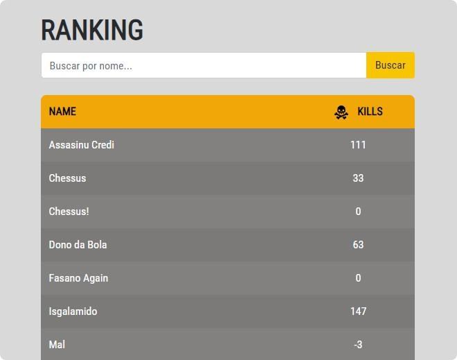

### Parserlog

Este é um pequeno parser de log de um jogo, o objetivo deste parser é consolidar as informações presentes no log, 
extraíndo os dados solicitados e apresentando de forma prática e legível. Este parser foi construído em php e também 
ofecere uma pequena inteface para facilitar uma pesquisa destes dados.

#### Banco de Dados

Ao realizar o parser dos dados de log, este dados são inserido em um banco de dados simples que segrega as informações extraídas. 
Para ter acesso aos arquivos deste banco de dados basta acessar a pasta database deste repositório.

#### Como Executar o Parser

> *Nota: Antes de executar o parser crie o banco de dados com os arquivos presentes na pasta database deste repositório. E troque as informações de conexão presentes no arquivo parserlog.php e webservices.php presentes no repositório source. Certifique-se que você tenha em sua linha de comando o php*

- Primeiro clone o repositório.

		git clone https://github.com/sancozta/parserlog.git
	
- Entre no repositório.

		cd parserlog
	
- Após criar o banco e trocar os dados de conexão execute o comando abaixo.

		php -f parserlog.php

- Este comando irá ler o arquivo de log games.log presente na pasta log do projeto. Irá fazer o parser dos dados e no final irá inserir no banco de dados.

#### Executando Pesquisas Pela Interface.

- Primeiro é preciso subir o servidor do próprio php, para isso execute o comando abaixo.

		php -S localhost:8080
	
- Acesse pelo seu navegador localhost:8080, certifique-se que o seu arquivo webservices.php esta com os dados de conexão corretos e que seu mysql esta sendo executado.

- Digite um nome que deseja procurar e click no botão buscar. Os resultados aparecerão na tabela abaixo. Para listar todos basta deixar o campo em branco e clicar em buscar.

#### Imagens Ilustrativas

  

